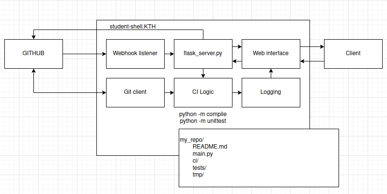

# assignment-2

## Structure
The repo itself will be structured in the following way:

```
.
├── ci-server
│   └── where we put the source for the CI-server itself 
├── doc
│   └── where we put all the documentation 
├── log
│   └── where we put all logs (will contain old build data)
├── main.py
├── README.md
├── test_ci-server
│   └── where we put all the tests of the CI-server
└── tmp
    └── where we clone the repo to be CI:d 

```

The server will be run at KTH student-shell2, using ngrok to tunnel past
KTH firewall. The whole program will be structured something like this:


We will inform CI failure/success through the use of GitHub build Status
via the GH REST API. We will create a simple web interface were build 
history can be viewed.

## Contributing / Workflow
We use a GitHub organization to track our development process, creating a project
to make use of Github's Kanban-like issue board and link this repository to said 
project. 

Thoroughly develop the backlog before starting to work on tickets.
Tickets are connected to specific branches that implement the tickets, these are
merged into our main branch through pull-requests.

### TBD - Trunk-based development
We used a trunk-based development model in which we, for each feature, bug, doc, etc,
create branches of the main branch indicating atomic changes relating to a specific
ticket. 

These branches *need* to be connected to an actual issue. For example, if I want
to add a feature, I create a branch titled feature/[ISSUE NUMBER]/name-of-feature.

Branches are merged to the main only through the use of GitHub pull requests.

### Conventional Commits
We used the format "conventional commits" in or commit messages. Every commit has the 
the following format (bar merge commits and conflict resolutions):

```
<type>(<optional scope>)<!>: <description>
<BLANK LINE>
<optional body>
<BLANK LINE>
<optional footer(s)>
```

### Releases
We do a trunk based release. Where we simply branch of the main branch into a release 
branch named `release/x.x.x`, tag it `x.x.x`, and possibly make a GH Release. Whether
we can make the server self-update on a specific release webhook is to be investigated.


### Squash and merge!
Always use the "squash and merge" option when merging GitHub PRs.


## Statement of contributions

# Rasmus Danielsson

# Dante Astorga Castillo

# Sebastian Montén


# Ludvig Skare

# Victor Stenmark

