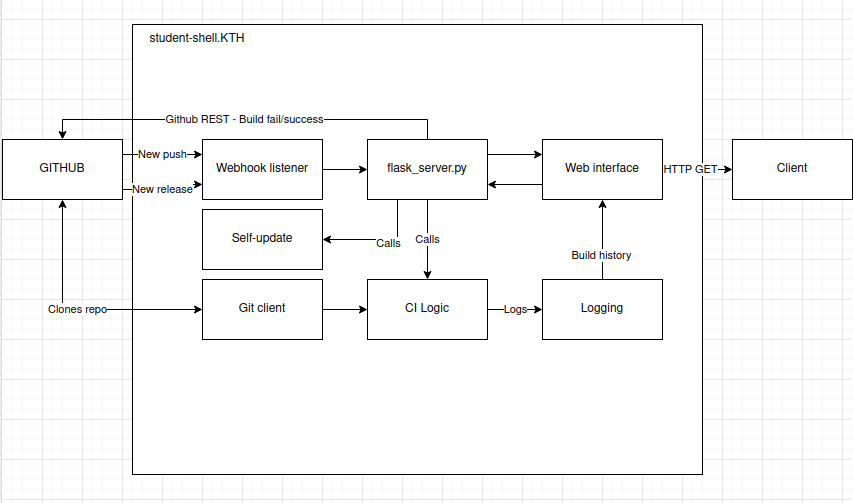

# assignment-2

## Structure
The repo itself will be structured in the following way:

```
.
├── ci-server
│   └── where we put the source for the CI-server itself 
├── docs
│   └── where we put all the documentation 
├── log
│   └── where we put all logs (will contain old build data)
├── main.py
├── README.md
├── test_ci-server
│   └── where we put all the tests of the CI-server
└── tmp
    └── where we clone the repo to be CI:d 

```

The server will be run at KTH student-shell2, using ngrok to tunnel past
KTH firewall. The whole program will be structured something like this:


We will inform CI failure/success through the use of GitHub build Status
via the GH REST API. We will create a simple web interface were build 
history can be viewed.

## Contributing / Workflow
We use a GitHub organization to track our development process, creating a project
to make use of Github's Kanban-like issue board and link this repository to said 
project. 

Thoroughly develop the backlog before starting to work on tickets.
Tickets are connected to specific branches that implement the tickets, these are
merged into our main branch through pull-requests.

### TBD - Trunk-based development
We used a trunk-based development model in which we, for each feature, bug, docs, etc,
create branches of the main branch indicating atomic changes relating to a specific
ticket. 

These branches *need* to be connected to an actual issue. For example, if I want
to add a feature, I create a branch titled feature/[ISSUE NUMBER]/name-of-feature.

Branches are merged to the main only through the use of GitHub pull requests.

### Conventional Commits
We used the format "conventional commits" in or commit messages. Every commit has the 
the following format (bar merge commits and conflict resolutions):

```
<type>(<optional scope>)<!>: <description>
<BLANK LINE>
<optional body>
<BLANK LINE>
<optional footer(s)>
```

### Releases
We do a trunk based release. Where we simply branch of the main branch into a release 
branch named `release/x.x.x`, tag it `x.x.x`, and possibly make a GH Release. Whether
we can make the server self-update on a specific release webhook is to be investigated.


### Squash and merge!
Always use the "squash and merge" option when merging GitHub PRs.

### Commit status notification and unit testing
Our implementation of commit status notifications include using GitHubs API to update the commit status of a certain commit. This was implemented by using the python library `requests` which simplified the curl POST request needed for the API. More specifically the CI server that we've built tests and evaluates each commit that is pushed to GitHub. The CI server evaluates the commit and returns "success" if all tests pass and "failure" or "error" depending on if the tests fail or if an error occurs respectively. This status is then passed on along with the hash of that commit to the function "create_commit_status" which uses the request library in order to create a POST request to GitHubs API. The POST request includes the status of the commit (if the commit passed the tests or not), a description of how the build went along with a target url which links that commit to our CI server. The target url link allows a user to be rerouted to our CI servers webpage where more information can be found such as build histories. Thus the resulting commit on GitHub recieves a status of how the build tests went which is displayed graphically on the commit. Making it very clear how the commit has performed. 

### Essence state
We are currently in the "In place" state of the Essence heirarchy. In the last assignment we said that we were in the "In use" state as we had only established how we wanted to work. As GitHub and a more structured way of working was new for some group members they had not fully adapted to and become used to the workflow of a larger group project. This has however changed for assignment 2 where all team members are now accustomed to the workflow where commit messages syntax, pull requests, solving merge conflicts and other workflow tools are now well established and work well. Thus all group members now work within the same workflow autonomously. This frees up time and effort to solely focus on the issues and on solving the assignment. With regard to this some ideas as to improve the workflow are still being made even if these constitute minor changes addressing minor inefficiencies. An example of this being how we approve and squash merge pull requests. Team wise we'd say that we are currently in the "collaborating" phase where all team members are working comfortably together as a unit. In order to further improve and achieve the next steps "Working well" and "performing" when it comes to workflow and team functionality we need to continue with what we're doing (in order to further establish our workflow) and focus on evaluating each assignment with constructive feedback to address issues and actively work on being a more effective team.


## Statement of contributions

# Rasmus Danielsson

# Dante Astorga Castillo

# Sebastian Montén

# Ludvig Skare

# Victor Stenmark
